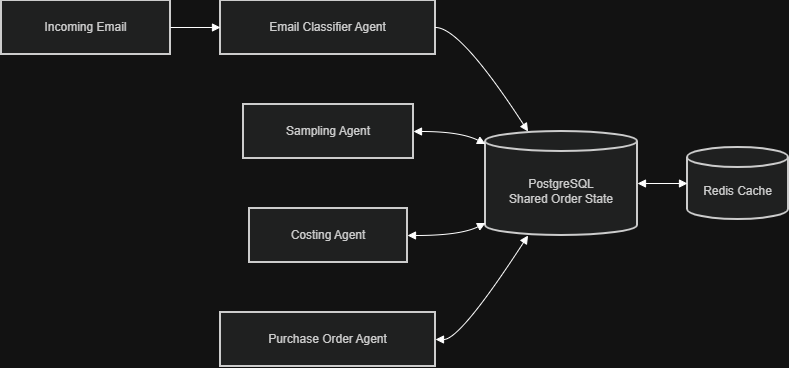
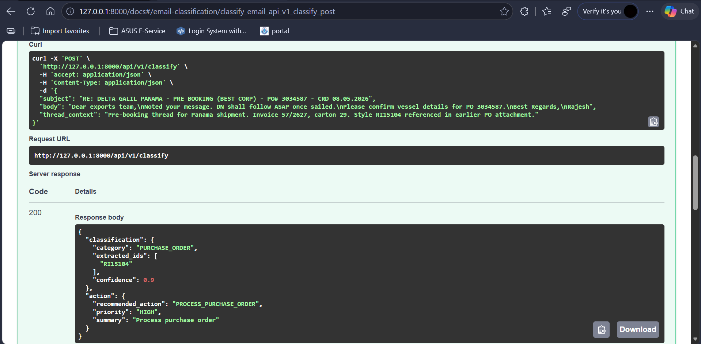

# LangChain Email Classification Pipeline

This document explains my approach to solving the email classification assignment. It acts as a companion to the original `README.md` and outlines the architecture, my design choices, and the proposed order-state model.

---

## Architecture Flow

The pipeline is split into two distinct chains to separate concerns. Here is exactly how an incoming email flows through the system:

```text
[ Incoming Email ]
  (Subject, Body, Context)
         │
         ▼
┌──────────────────────────────────────────┐
│ CHAIN 1: Classification & Extraction     │
│ 1. LLM categorizes the email.            │
│ 2. LLM extracts raw Style IDs.           │
│ 3. Parser runs Regex cross-check.        │
│ 4. Output forced into Pydantic model.    │
└──────────────────────────────────────────┘
         │
         ▼  (Passes ClassificationResult object)
         │
┌──────────────────────────────────────────┐
│ CHAIN 2: Action Recommendation           │
│ 1. Takes Chain 1's structured output.    │
│ 2. Maps category to operational action.  │
│ 3. Output forced into Pydantic model.    │
└──────────────────────────────────────────┘
         │
         ▼
[ Final JSON Response ]
```

---

## Project Structure

I organized the codebase to keep the API layer completely separate from the LangChain/LLM logic.

```text
app/
├── api/
│   └── routes.py          # The FastAPI endpoints (/classify and /health)
├── llm/
│   ├── chains.py          # Where Chain 1 and Chain 2 are built (RunnableLambda)
│   ├── models.py          # All Pydantic schemas and Enums (the data rules)
│   ├── parser.py          # Custom parsers (extracts JSON, runs Regex filters)
│   └── prompts.py         # The exact instructions sent to the LLM
├── services/
│   └── email_pipeline.py  # The orchestrator that wires Chain 1 into Chain 2
├── config.py              # Environment variable management (.env)
└── main.py                # Starts the FastAPI server

tests/
└── test_chains.py         # 10 test cases (runs locally without hitting the API)

docker-compose.yml         # Easy setup script for the team
Dockerfile                 # Multi-stage build for production
```

---

##  How to Run

You can run this project using a standard local Python environment or via Docker.

**1. Set up your API Key:**
```bash
cp .env.example .env
# Open .env and add your GROQ_API_KEY
```

### Option A: Local Setup (Standard)
```bash
# Create and activate a virtual environment
python -m venv .venv
source .venv/bin/activate  # Or .venv\Scripts\activate on Windows

# Install dependencies
pip install -r requirements.txt

# Run the FastAPI server
uvicorn app.main:app --reload --port 8000
```
The API is now live. Open `http://localhost:8000/docs` in your browser to test it visually using the Swagger UI.

**Running Tests locally:**
*(Tests are fully mocked, so no API key is needed)*
```bash
pytest tests/ -v
```

### Option B: Docker Compose (Additional)
If you prefer not to install dependencies locally, you can use the included Docker setup.
```bash
docker compose up
```
*(The API will be available at the same `http://localhost:8000/docs` URL)*.

---
### Why I Used RunnableLambda(chains.py)

A simple LCEL pipeline (`prompt | llm | parser`) works well when the workflow only contains prompting and output parsing.

In this solution, I needed additional logic around the LLM call, such as:

* Combining email fields before processing
* Logging inputs and outputs for debugging
* Parsing the raw LLM response into Pydantic models
* Validating extracted Style IDs using regex checks

Because of these extra processing steps, I wrapped the logic inside Python functions and exposed them as LangChain runnables using `RunnableLambda`.

This allowed me to keep the custom business logic inside each chain while still using LangChain's runnable interface and chain composition capabilities.


---

## Design Answers (Answers based on the README)

Here are the answers to the architectural questions posed in the assignment brief.

### 1. Why build two separate chains instead of one?
I separated the workflow into two chains because they have different responsibilities. Chain 1 focuses on understanding the email and extracting information, while Chain 2 focuses on deciding what action should be taken. Keeping them separate makes the code easier to maintain, test, and extend in the future

### 2. How do you prevent the LLM from hallucinating Style IDs?
I don't directly trust the LLM output. After the LLM extracts the IDs, I use regex validation to check whether those IDs actually exist in the original email text. If an ID is not found in the email, it is removed. This helps prevent hallucinated style IDs from being returned.(it works via parser.py file)

### 3. How do you test without calling the LLM API every time?
I use MagicMock to simulate LLM responses during testing. Instead of making real API calls, the mock returns predefined responses. This allows me to test the chain logic, parser, validation, and output models quickly without depending on the actual LLM service.

### 4. How would you add a new email type (e.g., INSPECTION_REQUEST)?
The chain architecture remains the same. I would simply add the new category to the classification prompt, update the output model if needed, and add the corresponding action recommendation logic. Since the chains are already separated by responsibility, no major code changes are required. 
(Enum and pydantic flow must be modified based on.)

---
## Proposed Shared Order-State Model

This section addresses Questions 5 and 6 from the assignment.

### What is the minimal shared order-state model that allows multiple agents to collaborate without overwriting each other's updates?

In a real production system, multiple AI agents may work on the same order. For example, a Sampling Agent may track sample requests, a Costing Agent may manage pricing discussions, and a Purchase Order Agent may handle PO updates.

To allow these agents to collaborate, I would maintain a shared order record in PostgreSQL. This record acts as the source of truth for the order and stores its latest status.

Each agent should only update the fields related to its responsibility. For example, the Sampling Agent updates sample-related fields while the Costing Agent updates costing-related fields. This prevents agents from accidentally overwriting each other's work.

A minimal order state could look like:

```json
{
  "order_id": "RI15104",
  "buyer_name": "Buyer Name",
  "sample_status": "APPROVED",
  "costing_status": "PENDING",
  "po_status": "NOT_RECEIVED",
  "last_updated": "2026-06-03T10:00:00Z"
}
```

PostgreSQL would be used for long-term storage and as the source of truth. Redis could be added later as a caching layer to improve performance and reduce repeated database reads.

### Shared Order-State Flow



---

### Which fields from techpack/client docs are important to persist for future flows?

Although the current solution only uses email data, future workflows may require information from tech packs and client documents.

Important fields to persist include:

* Style Reference ID
* Buyer Name
* Target FOB
* Critical Request Date (CRD)
* Fabric Details
* Fabric Status
* Colorways
* Size Range
* Assigned Team or Owner
* Tech Pack Reference or URL

Storing these fields allows future agents to access important business information without repeatedly processing the same documents.

---

## API Output



The API exposes a POST endpoint at `/api/v1/classify`. You send the email's subject, body, and optional thread context as a JSON payload and get back the classification and recommended action in one response. The Swagger UI at `/docs` lets you test this directly in the browser without writing any code. Both chains run automatically in the background, just get the final structured output.
